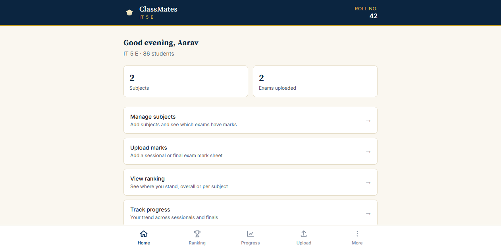
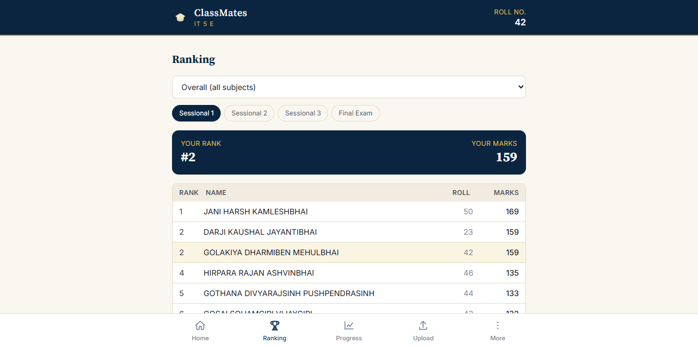
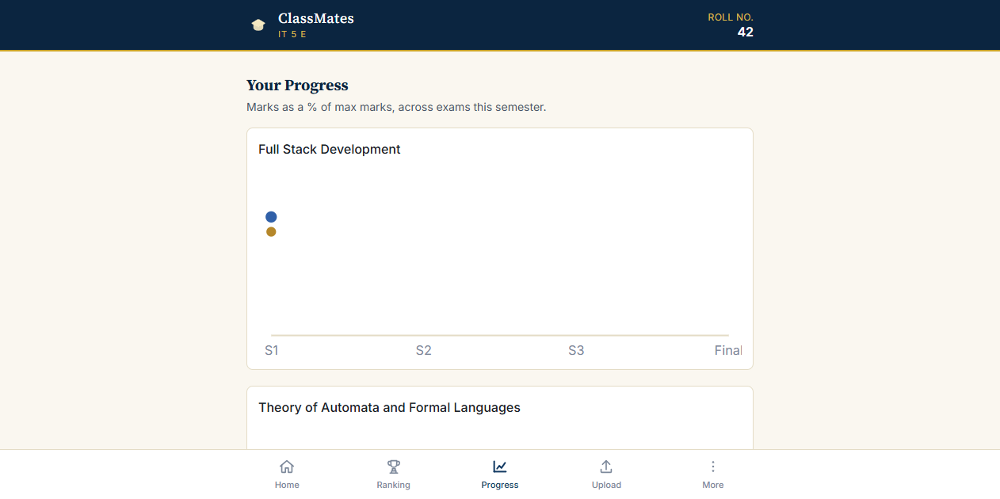

# ClassMates

See where you stand in your class. Upload the roll number list and exam marks your department already publishes — ClassMates works out the ranking, tracks your progress across sessionals and finals, and highlights your own row everywhere.

No login. No account. **Everything stays on your phone.**

<p align="center">
  
  
  
</p>

## Step 1 — Star this repo

This app is only distributed from this GitHub repository. Before you install it, **star this repo** using the ⭐ button at the top of this page. That's what keeps this free and worth maintaining.

## Step 2 — Install it on your phone

ClassMates is a Progressive Web App (PWA) — there is no app store listing and nothing to sideload. You install it straight from your browser, and it works fully offline afterward.

**➡️ Open this link on your phone: [yashantala2-cloud.github.io/classmate](https://yashantala2-cloud.github.io/classmate/)**

### Android (Chrome)

1. Open the link above in Chrome.
2. Tap the **⋮** menu in the top right.
3. Tap **Add to Home screen** → **Install**.
4. Open ClassMates from your home screen like any other app.

### iPhone / iPad (Safari)

1. Open the link above in Safari (it must be Safari, not Chrome, for this to work on iOS).
2. Tap the **Share** icon at the bottom.
3. Tap **Add to Home Screen** → **Add**.
4. Open ClassMates from your home screen.

### Desktop (Chrome / Edge)

Open the link, then click the install icon in the address bar (or the browser menu → **Install ClassMates**).

## Your data stays on your device

This is the whole point of the app:

- 🔒 **No login or sign-up.** Just enter your roll number and name once — that's how ClassMates knows which row is yours.
- 📱 **All data is stored locally on your phone** — your class roster, every mark sheet you upload, every ranking. Nothing is uploaded anywhere.
- ☁️ **Cloud sync is planned, not required.** A future version will let you optionally sign in to back up your data to the cloud. Until then, use **Settings → Export backup** to save a copy, or to hand your class's data to a classmate.

## How it works

1. **Set up your profile** — enter your roll number and name (once, ever).
2. **Set up your class** — upload your class's roll number list as a PDF or Excel sheet. ClassMates reads it and lists every student; you review and fix anything it misread before saving.
3. **Add your subjects** — one entry per subject for the semester.
4. **Upload marks** — for each subject, for each of the 3 sessionals and the final exam, upload the marks sheet your department publishes (PDF, Excel, or a photo of the printed sheet). ClassMates reads the roll numbers and marks automatically, then shows you an editable table to confirm or correct before saving — this matters most for photos, where misreads are common.
5. **See your ranking** — per subject, per exam, or an overall ranking combining every subject. Your row is always highlighted.
6. **Track your progress** — your marks and the class average, side by side, across every exam this semester.

## Why review grids everywhere?

Reading a scanned or photographed marks sheet automatically will sometimes get it wrong — a blurry digit, a shadow, a skewed photo. Rather than trust it silently, ClassMates always shows you an editable table before saving anything, pre-filled with its best guess. You're always the one confirming what actually gets stored.

## Tech notes

Built as a single-page PWA: React + TypeScript + Vite, IndexedDB for local storage (via Dexie), on-device OCR (Tesseract.js) for photo uploads, and PDF/Excel parsing entirely in the browser — no backend, nothing to deploy, nothing that can see your data but you.

## Development

```bash
npm install
npm run dev      # local dev server
npm run build    # production build → dist/
```

Pushing to `main` deploys automatically to GitHub Pages via `.github/workflows/deploy.yml`.

## License

MIT — see [LICENSE](LICENSE).
